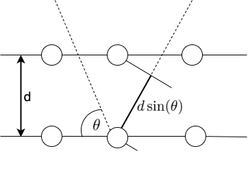
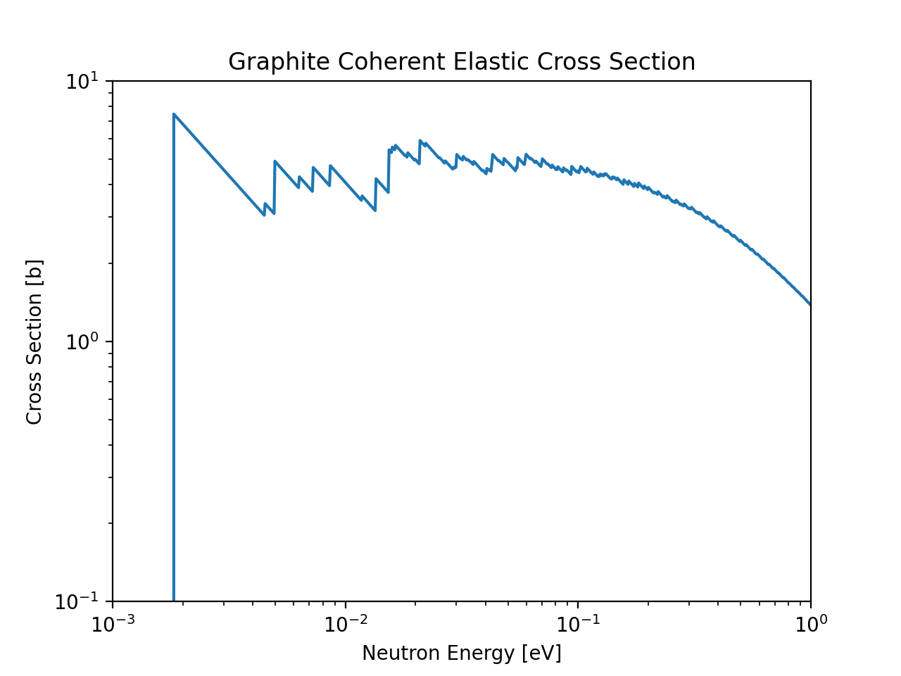

..
  COMMENT: .. contents:: Table of Contents

Overview & Bragg's Law
===============================

Coherent neutron scattering refers to periodic constructive amplitude growth or destructive amplitude cancellation of scattered neutron waves. There are two prerequisites for coherent scattering: (1) the target atoms must be coherent scatterers, and (2) the target atoms must have strong spatial correlation (e.g. crystalline lattice). 

Typically, coherent neutron scattering is too difficult to calculate, and is ignored via the **incoherent approximation**. However, for the special case of coherent elastic scattering, in which the neutron does not gain/lose energy during the scattering process, coherence can be considered.

Coherent elastic scattering follows Bragg's Law, 

.. math::
  2d\sin(\theta) = n\lambda

where :math:`d` is the distance between atomic layers in a crystal, :math:`\theta` is the scattering angle, :math:`n` is a positive integer, and :math:`\lambda` is the neutron wavelength. A visual representation of Bragg's law is provided below, showing that the neutron wavelength must be integer multiples of the distance traveled between atom planes. 

From Bragg's law, we see that only select neutron wavelengths will be able to scatter coherently. And since neutron energy is directly related to its wavelength, then the coherent scattering of specific neutron energies will be highly favored. This is shown via the Bragg edges of the coherent elastic cross section:

As shown in the above plot, the coherent elastic cross section is characterized by very strong peaks called "Bragg Edges". The coherent elastic cross section is zero before the first bragg edge (which usually occurs around 2-5 meV). It then jumps sharply at the first bragg edge, then drops off as :math:`1/E` until the second bragg edge, at which point it jumps sharply again, and continues on. The sizes of the steps of the cross section gradually gets smaller, and at high energies there is nothing left but an asymptotic :math:`1/E` decrease.

.. Since a prerequisite for coherent elastic scattering is spatial correlation of atomic sites, this type of scattering is not considered for amorphous solids or liquids, only regular repeating strucures (e.g. FCC, BCC, HCP, etc.). 

.. If a material is comprised of strong coherent scatterers (e.g. graphite) where there is strong spatial correlation between atomic sites (such as in a crystalline material), the scattered neutron waves from zero-phonon collisions can interfere, creating **coherent elastic scattering**. This scattering phenonema leads to "Bragg diffraction". 

.. The differential coherent elastic scattering cross section is given by 

.. .. math:: 
  \sigma_{coh.el}(E,\mu)=\frac{\sigma_c}{E}\sum_{E_i<E}f_i~\mathrm{e}^{-4WE_i}~\delta(\mu-\mu_i)

.. where 

.. .. math::
  \mu_i=1-\frac{E_i}{E}.

.. Furthermore, the integrated cross section is given by 

.. .. math:: 
  \sigma_{coh.el}(E)=\frac{\sigma_{coh}}{E}\sum_{E_i<E}f_i~\mathrm{e}^{-4WE_i}.

.. Here, :math:`\sigma_{coh}` is the effective bound scattering cross section for the material, :math:`E_i` are the "Bragg Edges", :math:`f_i` are related to the crystallographic structure factors, and 

  

