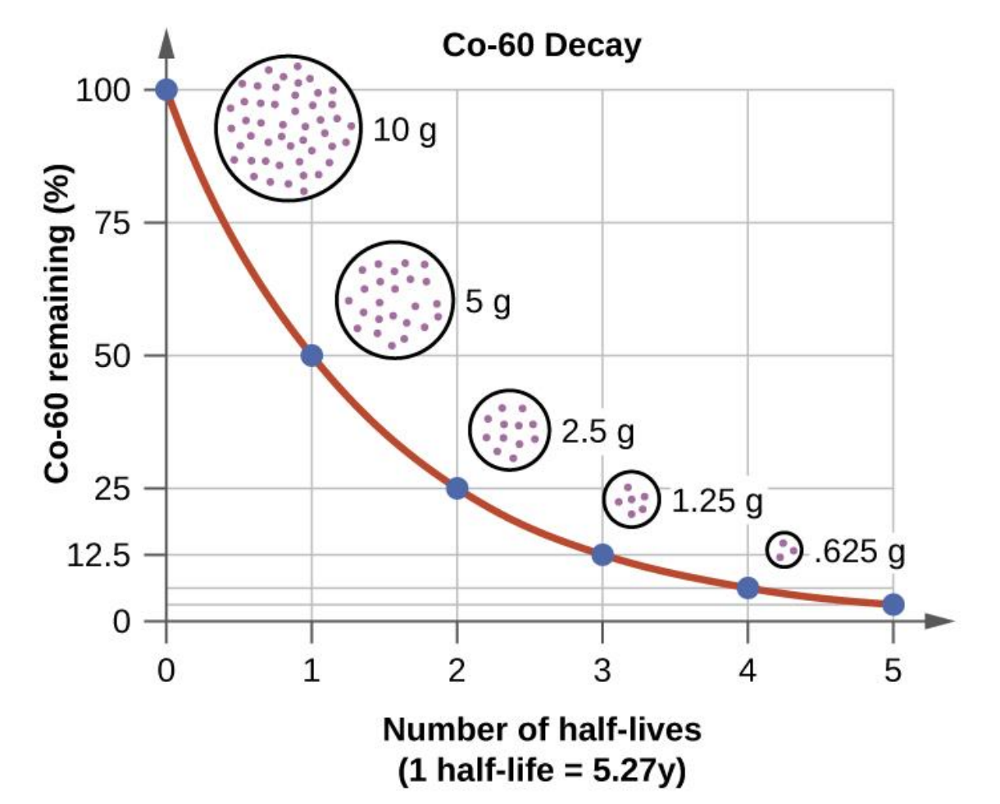

.. This is a comment. Note how any initial comments are moved by
   transforms to after the document title, subtitle, and docinfo.

.. demo.rst from: http://docutils.sourceforge.net/docs/user/rst/demo.txt

.. _background_key_eqs:

**************************************
Background of Key Equations
**************************************

If a material's atoms have randomly distributed spins or isotope types, then the scattering of neutrons can be expressed as a sum of a coherent part and an incoherent part.
.. cThe double differential scattering cross section for thermal neutrons is comprised of a coherent component and an incoherent component,

.. The probability of a neutron with initial energy and solid angle scattering to have some final energy and solid angle :math:`(E',\Omega')` is described using the double differential scattering cross section :math:`\sigma(E\rightarrow E', \Omega\rightarrow\Omega')`. The scattering cross section has a coherent and an incoherent component, 

.. math::
  \sigma(E\rightarrow E',\Omega\rightarrow\Omega') = \sigma_{inc}(E\rightarrow E',\Omega\rightarrow\Omega') + \sigma_{coh}(E\rightarrow E',\Omega\rightarrow\Omega').

Note that the spin correlations of ortho and para hydrogen violate the assumption of randomness, so liquid hydrogen and deuterium must be desribed separetely. This will be covered in :ref:`coldh`.

.. _background_coh_inc:

Coherent vs Incoherent Scattering
======================================
Neutron scattering is the interaction of wavefunctions, where the incoming neuton wave interacts with a target and creates a scattered spherical wave. This is simply due to the fact that a large incoming wave hitting a (relatively) small target will result in a spherical scattered wave. Additionally, large thermal neutron wavelength means that the neutron can exist atop multiple atoms at once, creating simultaneous scattering sites. 

When these scattered spherical waves, which originate from different scattering sites interfere, they can do so either coherently (meaning periodic constructive growth or destructive cancellation) or incoherently (meaning that no large-scale periodic growth or cancellation occurs). 

The coherent and incoherent scattering contributions have the following forms, 

.. math::
  \sigma_{inc}(E\rightarrow E',\Omega\rightarrow\Omega') = \frac{\sigma_{inc}}{4\pi\hbar}\sqrt{\frac{E'}{E}}\frac{1}{2\pi}\int_{-\infty}^\infty \int \mathrm{e}^{\epsilon t/\hbar-\mathbf{k}\mathbf{r}}~G_s(\mathbf{r},t)~d\mathbf{r}~dt

  \sigma_{coh}(E\rightarrow E',\Omega\rightarrow\Omega') = \frac{\sigma_{coh}}{4\pi\hbar}\sqrt{\frac{E'}{E}}\frac{1}{2\pi}\int_{-\infty}^\infty \int \mathrm{e}^{\epsilon t/\hbar-\mathbf{k}\mathbf{r}}~G(\mathbf{r},t)~d\mathbf{r}~dt

where the above integrals are only dependent on changes of neutron energy :math:`\epsilon=E'-E` and changes of neutron momentum :math:`\hbar\mathbf{k}=m(\mathbf{v'}-\mathbf{v})`, rather than than absolute energy and momentum. The :math:`G(\mathbf{r},t)` function that appears in the coherent contribution is the **pair distribution function**, which has a "self" component :math:`G_s` which appears in the incoherent constribution and a "distinct" component :math:`G_d`.

.. math::
  G(\mathbf{r},t)=G_s(\mathbf{r},t)+G_d(\mathbf{r},t)

Speaking loosely, if there exists a particle at the origin at time :math:`t=0`, then :math:`G(\mathbf{r},t)` is the probability that a particle is at location :math:`\mathbf{r}` at time :math:`t`. The self component is when the particle at :math:`\mathbf{r}` is the same particle that was at the origin, whereas the distinct component assumes that they are not the same particle. 
Naturally, the distinct component is significantly harder to compute, which is not necessary for the incoherent contribution, but *is* necessary for the coherent. 

.. _incoherent_approximation:

Incoherent Approximation
======================================
Modern thermal neutron scattering calculations typically rely on the **incoherent approximation**, which assumes that the distinct component of the pair distribution function :math:`G_d(\mathbf{r},t)` is negigible, meaning that the coherent scattering contribution has the same form as the incoherent contribution. For gasses, liquids, and solids that contain randomly oriented crystallites, this assumption is typically valid. 

The incoherent approximation allows us to simplify the scattering cross section equation to be

 .. math::
  \sigma(E\rightarrow E',\Omega\rightarrow\Omega') = \frac{\sigma_{b}}{4\pi\hbar}\sqrt{\frac{E'}{E}}\frac{1}{2\pi}\int_{-\infty}^\infty \int \mathrm{e}^{\epsilon t/\hbar-\mathbf{k}\mathbf{r}}~G_s(\mathbf{r},t)~d\mathbf{r}~dt

where the bound scattering cross section :math:`\sigma_b=\sigma_{inc}+\sigma_{coh}`.

.. _scatteringLaw:

Scattering Law
======================================
The cross section equation above is often represented in terms of the **scattering law** :math:`S(\alpha,\beta)`, which is the result of two Fourier transforms in time and space, and a change of variables to make momentum exchange and energy exchange unitless. These new unitless momentum and energy exchanges, :math:`\alpha` and :math:`\beta`, respectively, are defined as 

.. math::
  \begin{aligned}
    \alpha &=\frac{E'+E-2\mu\sqrt{E'E}}{Ak_bT} = \frac{\hbar^2\mathbf{k}^2}{2Amk_bT}

    \beta &=\frac{E'-E}{k_bT} = \frac{\epsilon}{k_bT}
  \end{aligned}

Finally, the change in neutron angle is assumed to be isotropic in the azimuthal angle, meaning that we need only care about the scattering cosine (in the lab frame) :math:`\mu`, instead of the full change of solid angle. This allows our final scattering cross section (for gasses, liquids, and solids with randomly oriented crystallites) to be represented as 

.. math::
    \sigma(E\rightarrow E',\mu) = \frac{\sigma_b}{k_bT}\sqrt{\frac{E'}{E}}~S(\alpha,\beta).
    
The main difficulty with preparing thermal neutron scattering data involves calculating the scattering law. How exactly the scattering is computed, will be discussed in [LINK TO LEAPR DOCUMENTATION].

For systems in thermal equilibrium, there is a relationship between upscatter and downscatter called "detail balanced", that is a consequence of microscopic reversibility. It requires that 

.. math:: 
  S(\alpha,\beta)=\mathrm{e}^{-\beta}~S(\alpha,-\beta)

Note that liquid hydrogen and deuterium violate this condition. For convenience, some use the above relation to define the "symmetric scattering law" :math:`S_{sym}(\alpha,\beta)`, which is even in :math:`\beta`, 

.. math:: 
  S_{sym}(\alpha,\beta)=S_{sym}(\alpha,-\beta).

In all equations used in the LEAPR and THERMR documentation, we will use the non-symmetric scattering law. 

In addition, the scattering law satisfies two additional constraints:

.. math::
  \begin{align}
  \mbox{Normalization}&\qquad\int_{-\infty}^\infty S(\alpha,\beta)~d\beta=1\\
  \mbox{The Sum Rule }&\qquad\int_{-\infty}^\infty \beta~S(\alpha,\beta)~d\beta=-\alpha
  \end{align}

In these All we deal solely with the non-symmetric scattering law. It is related to the symmetric scattering law :math:`S_{sym}(\alpha,\beta)` by an exponential in :math:`\beta`:

.. math:: 
  S_{sym}(\alpha,\beta)=\mathrm{e}^{\beta/2}~S(\alpha,\beta)

.. where for most solids, the scattering law is defined in terms of the phonon density of states :math:`\rho(\beta)`, 

.. .. math::
..     S(\alpha,\beta) = \frac{1}{2\pi}\int_{-\infty}^\infty\mathrm{e}^{i\beta t}~\mathrm{e}^{\gamma(t)-\gamma(0)}~dt

.. .. math::
    \gamma(t)=\alpha\int_{-\infty}^\infty \frac{\rho(\beta)}{2\beta\sinh(\beta/2)}~\mathrm{e}^{-i\beta t}~\mathrm{e}^{-\beta/2}~d\beta

  
In the incoherent approximation, these are the equations that need to be solved to prepare thermal neutron scattering data for most solids.

