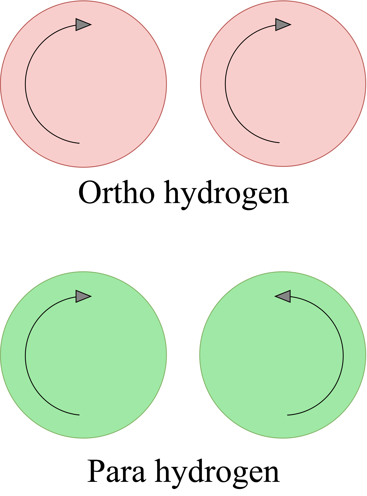

.. This is a comment. Note how any initial comments are moved by
   transforms to after the document title, subtitle, and docinfo.

.. demo.rst from: http://docutils.sourceforge.net/docs/user/rst/demo.txt

.. |EXAMPLE| image:: _images/temp.png
   :width: 1em

.. _coldh:

***********************************************
Cold Hydrogen and Deuterium 
***********************************************

In :ref:`background_key_eqs`, we made the assumption that spins are randomly distributed. This approximation is valid for most materials, but breaks down when describing liquid hydrogen and deuterium. To correct this error, quantum mechanical treatment is required to account for spin-spin correlations for atoms in the same molecule/structure.

For the remainder of this discussion, "hydrogen" will refer to the element, i.e. both :math:`^1\mathrm{H}` and :math:`^2\mathrm{D}`. 

For describing the spin-spin correlation for hydrogen, two cases are considered: *ortho* and *para*. Ortho hydrogen indicates that the spins of the nuclei are in the same direction, whereas para hydrogen indicates that the spins are in opposite direction.

    Ortho and para describe the alignment of the spins that can occur in a pair of hydrogens. Ortho corresponds to the spins going in the same direction, whereas para corresponds to them going in the opposite direction. 

There are two different scattering law equations that describe cold hydrogen scattering, depending on the relative spin directions (ortho and para).

.. math::
  S_{n.sym}^{ortho}(\alpha,\beta)=\sum_{J~odd} \frac{P_J4\pi}{\sigma_b}\Big[ A_{ortho}\sum_{J'~even}F(J,J') + B_{ortho}\sum_{J'~odd} F(J,J') \Big]

.. math::
  S_{n.sym}^{para}(\alpha,\beta)=\sum_{J~even} \frac{P_J4\pi}{\sigma_b}\Big[ A_{para}\sum_{J'~even}F(J,J') + B_{para}\sum_{J'~odd} F(J,J') \Big]

.. math::
  F(J,J')=\big(2J'+1\big)~S_f(\omega\alpha,\beta+\beta_{JJ'})\sum_{l=\left|J'-J\right|}^{J'+J}4j_l^2(y)C^2(JJ'l;00)

Here you go

  +-------------------+---------------------------+------------------------------------+
  | Symbol            | Name                      |  Other Definition                  |
  +===================+===========================+====================================+
  | | :math:`A        | | Summation               | | Defined in the table below as    |
  |   _{ortho,para}`  |   coefficients            | | a function of :math:`a_c`        |
  | | :math:`B        |                           |   and :math:`a_i`                  |
  |   _{ortho,para}`  |                           |                                    |
  +-------------------+---------------------------+------------------------------------+
  | :math:`a_c` and   | | Coherent and incoherent | | Related to the coherent,         |
  | :math:`a_i`       | | scattering lengths      | | incoherent, and total bound      |
  |                   |                           | | scattering cross sections via    |
  |                   |                           | | :math:`\sigma_c=4\pi a_c^2\quad` |
  |                   |                           |   :math:`\sigma_i=4\pi a_i^2`      |
  |                   |                           | | :math:`\sigma_b=\sigma_c+\sigma_i|
  |                   |                           |   =4\pi\big(a_c^2+a_i^2\big)`      |
  +-------------------+---------------------------+------------------------------------+
  | :math:`P_J`       | | Statistical weight      |                                    |
  |                   | | factor                  |                                    |
  +-------------------+---------------------------+------------------------------------+
  | :math:`\beta      | | Energy transfer for a   | | :math:`\beta_{JJ'}=              |
  | _{JJ'}`           | | rotational transition   |  (E_{J'}-E_J)/k_bT`                |
  +-------------------+---------------------------+------------------------------------+
  | :math:`j_l(x)`    | | Spherical Bessel        |                                    |
  |                   | | function of order       |                                    |
  |                   |   :math:`l`               |                                    |
  |                   |                           |                                    |
  +-------------------+---------------------------+------------------------------------+
  | | :math:`C(       | | Clebsch-Gordan          |                                    |
  |   JJ';00)`        | | coefficient factor      |                                    |
  +-------------------+---------------------------+------------------------------------+
  | :math:`y`         |                           | | :math:`y=\kappa a/2`             |
  |                   |                           | | :math:`y=a                       |
  |                   |                           |   \sqrt{4Mk_bT\alpha/8}`           |
  +-------------------+---------------------------+------------------------------------+
  | :math:`a`         | | Interatomic distance    |                                    |
  |                   | | in the molecule         |                                    | 
  +-------------------+---------------------------+------------------------------------+
  | :math:`\omega_t`  | | Translational weight    | | :math:`1/2` for                  |
  |                   |                           |   :math:`^1\mathrm{H}` and         |
  |                   |                           |   :math:`1/4` for                  |
  |                   |                           |   :math:`^2\mathrm{D}`             |
  +-------------------+---------------------------+------------------------------------+
  | :math:`S_f        | | Free gas scattering law | | :math:`S_f(\alpha,\beta)=\frac{1}|
  | (\alpha,\beta)`   |                           |   {\sqrt{4\pi\omega_t\alpha}}      |
  |                   |                           |   \mathrm{exp}\left[-\frac{        |
  |                   |                           |   (\omega_t\alpha+\beta)^2}        |
  |                   |                           |   {4\omega_t\alpha}\right]`        |
  +-------------------+---------------------------+------------------------------------+

.. note::
  The summation coefficients :math:`A_{ortho,para}` and :math:`B_{ortho,para}` are provided for the relative materials in the table below. Here, :math:`a_c` and :math:`a_i` are the coherent and incoherent scattering lengths [#f1]_ .

  +--------------------+-------------------+------------------------+-------------------+-------------------+
  | **Spin Alignment** | :math:`^1\mathrm{H}`                       | :math:`^2\mathrm{D}`                  |
  +====================+===================+========================+===================+===================+
  |                    | :math:`A` (even)  | :math:`B` (odd)        | :math:`A` (even)  | :math:`B` (odd)   |
  +--------------------+-------------------+------------------------+-------------------+-------------------+
  | **Ortho**          | :math:`a_c^2/3`   | :math:`a_c^2+2a_i^2/3` | :math:`a_c^2      | :math:`3a_i^2/8`  |
  |                    |                   |                        | +5a_i^2/8`        |                   |
  +--------------------+-------------------+------------------------+-------------------+-------------------+
  | **Para**           | :math:`a_c^2`     | :math:`a_i^2`          | :math:`3a_i^2/4`  | :math:`a_c^2      |
  |                    |                   |                        |                   | a_i^2/4`          |
  +--------------------+-------------------+------------------------+-------------------+-------------------+

  .. [#f1] Scattering lengths are related to bound cross sections by the surface are of a sphere. For example, if the coherent scattering length is :math:`a_c`, then the bound coherent scattering cross section is :math:`\sigma_{c}=4\pi a_c^2`. Furthermore, the total bound cross section :math:`\sigma_b=\sigma_c+\sigma_i` would be equal to :math:`4\pi(a_c^2+a_i^2)`.

.. .. code-block:: python
   :emphasize-lines: 3,5
   # user-provided values
   S(k)      = [ s0, s1, s2, ... ] # static structure factor S(k)
   kappaGrid = [ k0, k1, k2, ... ] # kappa grid that S(k) is on 
   for b in betas:
     for a in alphas:
       kappa    = k(a) # from alpha calculate wave number 
       S(kappa)        # interpolate on S(k) grid for the given kappa value
       reducedAlpha = a / S(kappa)
       S_coh = S(
       
       

