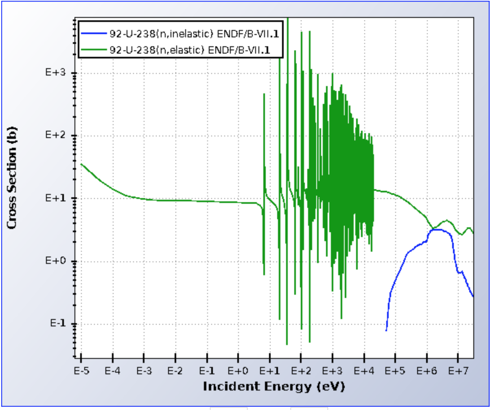

.. This is a comment. Note how any initial comments are moved by
   transforms to after the document title, subtitle, and docinfo.

.. demo.rst from: http://docutils.sourceforge.net/docs/user/rst/demo.txt

.. |EXAMPLE| image:: _images/temp.png
   :width: 1em

.. _general_theory:

**************************************
Overview of Thermal Neutron Scattering
**************************************

..
  COMMENT: .. contents:: Table of Contents

What are Thermal Neutrons?
===========================

Molecular bonds are typically on the order of a few eV, so for neutrons above this threshold, molecular structure will not significantly affect the scattering behavior. Thermal neutrons, which lie below this threshold, cannot consider a target atom in isolation but rather must consider the entire structure. 

Two interesting phenomena come into play for thermal neutrons:

 * **de Broglie wavelength**

  Thermal neutrons have a de Broglie wavelength that is on the order of 1 Angstrom, similar to typical interatomic spacings in solids. This means that a neutron may simulaneously interact with multiple atoms in the material, further complicating thermal scattering and forcing us to depart from classical intuition that may otherwise apply.

 * **Neutron-phonon interactions**

   Since thermal neutrons cannot break molecular bonds between atoms, they must interact with the larger, aggregate structure, which at finite temperatures has vibrational excitations. These vibrational modes, also known as phonons, can interact with thermal neutron scattering to create inelastic collisions. 

  If a thermal neutron collides off of a material, it has the possibility to create or destroy one or more phonons. If a neutron with incoming energy :math:`E_{in}` creates a phonon with energy :math:`E_{ph}`, the neutron's outgoing energy is :math:`E_{out}=E_{in}-E_{ph}`. Similarly, if the neutron were to destroy said phonon, its outgoing energy would be :math:`E_{out}=E_{in}+E_{ph}`.

  Thermal neutrons can interact with many phonons of different energies, and the distribution of possible phonons that could exist in a material is represented in that material's phonon density of states.

  Since thermal neutrons do not have sufficient energy to knock an atom from the material, any data prepared for a atom has to account for the material it belongs to. Thermal neutron scattering data must be prepared for "hydrogen in water", for example, instead of just for "hydrogen" in general.

For more information regarding phonons and the importance of the phonon distribution in thermal neutron scattering, please see :ref:`Vibrational (Phonon) Denstiy of States<background_phonon_dos>`

.. For neutrons above 1-10 eV, neutron scattering cross sections are functions of nuclide type, material temperature, and neutron energy. 
.. Molecular bonds are on the order of a few eV, so neutrons above about 10 eV are not strongly affected by material structure and their cross sections are simply a function of nuclide and neutron energy. For neutrons below 1-10 eV, material structure can also strongly affect scattering behavior. Slow neutrons have energies on the order of a materials vibrational modes, thus a scattering event could be strongly influenced by the creation or destruction of these normal modes (also known as phonons).

.. LEAPR aims to describe the ways in which low energy neutrons (with energy on the order of 1 eV or less) interact with material. Accurately describing these interactions is crucial for adequate modeling of thermal nuclear systems. A neutron at room temperature has an energy of approximately 0.025 eV, meaning that its de Broglie wavelength is about 1 angstrom which is close to typical interatomic spacing in materials. This can complicate neutron-target interactions, and thus describing thermal scattering must account for the wave-like behavior of neutrons. 

Elastic vs. Inelastic Scattering
================================

Definitions
----------------
Elastic scattering means that the total kinetic energy of the system (neutron plus target) is the same before and after the scattering collision. This is contrasted with inelastic scattering, where kinetic energy is not conserved. This change in energy is due to some excitation (or de-excitation) occurred. In terms of the scattering law, elastic scattering occurs when :math:`\beta=0`.

In :ref:`background_coh_inc` , we said that accounting for coherence (i.e., that :math:`G_d(\mathbf{r},t)` term) is not typically done, as it is too complicated. However in the special case of elastic scattering, coherence can be considered if there exists an ordered lattice, etc. For more information on this treatment, please see :ref:`coh_elastic`.  

Thermal neutrons, which collide off of entire lattices and molecules (rather than single atoms separate from their material) experience elastic and inelastic scattering different than fast neutrons. Here is a brief summary of some elastic/inelastic thermal neutron scattering facts.

----------------------------------------------------------------------------

**Does an elastically scattered neutron have the same incoming/outgoing energy?**

If a neutron scatters off of a target of similar size (e.g. a hydrogen nucleus), the neutron can lose nearly all its energy. If the target is significantly more massive than the neutron, however, conservation of momentum prevents the neutron from losing a large amount of its energy. 

When fast / resonance range neutrons scatter off of media, their incoming energy is so much larger than the molecular bonds of the scattering material, which allows the neutron to effectively "see" the target as just a free atom. Thermal neutrons, however, do not have enough incoming energy to allow them to ignore molecular and lattice bonds. They thus cannot scatter off of a free atom, but rather scatter off of an atom that is part of a much larger aggregate system. This can make it harder for the neutron to lose a large fraction of its energy in an elastic scattering event. 

The incoming and outgoing energies of scattered thermal neutrons are not the same, but will have a tendency to be much closer than those of higher energy neutrons. 

----------------------------------------------------------------------------

**Isn't inelastic scattering a threshold reaction?**

For high energy neutrons, the excitation associated with an inelastic collision is a *nuclear* excitation, where the target nucleus is brought to some excited state. This requires a significant amount of energy, and thus nuclear inelastic scattering is a *threshold* reaction, as seen below.

    Elastic and nuclear inelastic scattering cross sections for U-238 (from NNDC). Note that nuclear inelastic scattering is a threshold reaction that does not appreciable contribute until incoming neutrons have an incoming energy of about 0.1 MeV.

For thermal (low energy) neutrons, inelastic scattering is caused by some *molecular* or *lattice* excitation, where vibrational modes of a multi-atom system are excited. Molecular excitations can be induced by neutrons with energy on the order of 1 eV and do not exhibit the same extreme threshold behavior as does nuclear excitations. Thermal inelastic scattering is thus focused on molecular excitations. The availability of vibrational modes that could be excited in some lattice system is described by the vibrational frequency spectrum / phonon density of states / phonon frequency distribution. 

